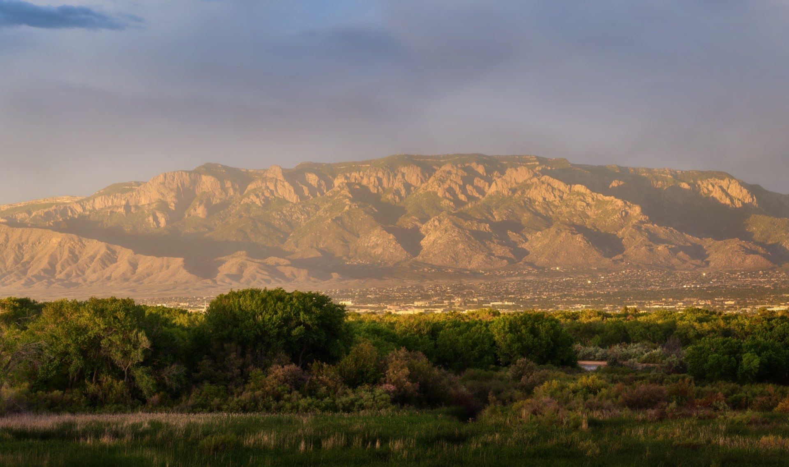

# Mountain Experience 🏔️

## Latest Achievement: Multi-Layer Parallax! 🎉

We've successfully implemented a beautiful multi-layer parallax experience featuring:

### Dynamic Layers 🌟
- Mountain background with subtle movement (-20%)
- Floating header text with fade effect
- Side panels with asymmetric speeds
- Elegant footer reveal

### Technical Highlights ⚡
- GSAP ScrollTrigger animations with variable speeds
- GPU-accelerated transforms for smooth performance
- Intelligent debug console with position tracking
- Responsive design with backdrop filters

### Interactive Elements 🎮
- CTA buttons with hover effects
- Draggable debug console
- Smooth scroll animations
- Position-persistent interface

### Experience Versions 🚀
- `index3.php`: Three-layer parallax with debug console
- `index4.php`: Enhanced version with refined animations

Special thanks to Jeanne for the inspiration and guidance! 💫

An immersive audio-visual journey combining classical music with interactive mountain landscapes.



## Documentation

- [User Experience Guide](docs/UX.adoc) - Comprehensive guide to the user interface and experience
- [Technical Documentation](TECHNICAL.md) - Setup commands, scripts, and procedures
- [Development Overview](TODO/PMTNM/overview.md) - Project roadmap and development plans

## Features

1. **Audio Experiences**
   - Stravinsky conducting L'Histoire du Soldat
   - Haydn's The Creation
   - Baroque voice and lute performance
   - Real-time waveform visualization
   - Smooth audio transitions

2. **Visual Elements**
   - Parallax mountain landscapes
   - Dynamic gradient overlays
   - Responsive header design
   - Interactive controls
   - Smooth animations

3. **Technical Highlights**
   - GSAP animations
   - WaveSurfer.js audio visualization
   - Optimized 30-second audio clips
   - Pre-generated waveform images
   - Cache control system

## Quick Start

```bash
# Clone the repository
git clone [repository-url]

# Install dependencies
npm install

# Generate waveform images
python3 utils/generate_waveform.py

# Start MAMP server
# Visit http://localhost:8888/cmiller/public_html/git/welcome/
```

## Development Requirements

### Tools
- MAMP (for local development)
- Python 3.x with pydub, numpy, PIL
- FFmpeg (for audio processing)
- Modern web browser with Web Audio API support

### Configuration
- Audio settings in `config/audio.json`
- Visual settings in `config/visual.json`
- MAMP configuration in PHP files

## Contributing

1. Check the [Development Overview](TODO/PMTNM/overview.md) for planned features
2. Review the [Technical Documentation](TECHNICAL.md) for setup
3. Follow the [User Experience Guide](docs/UX.adoc) for design consistency
4. Submit pull requests with clear descriptions

## License

This project is licensed under the MIT License - see the [LICENSE](LICENSE) file for details.

## Acknowledgments

- Mountain photography: Sandia Mountains, New Mexico
- Audio selections: Public domain classical recordings
- Technical inspiration: Modern web audio visualization techniques


